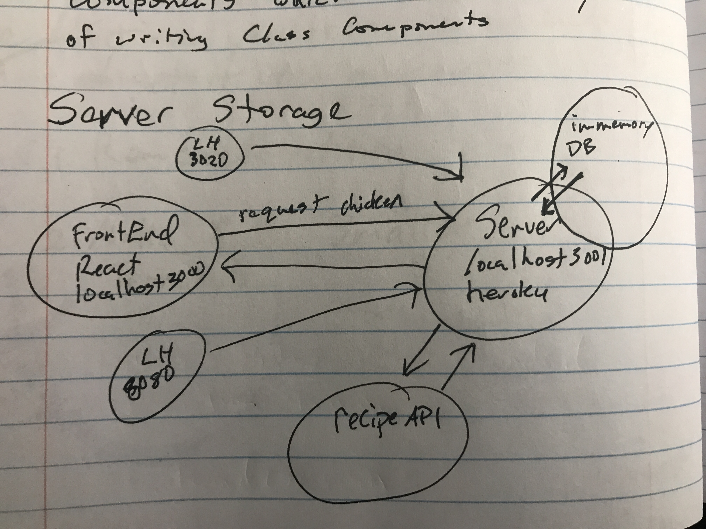

# cit-explorer

**Author**: Dan Engel
**Version**: 1.0.0 (increment the patch/fix version number if you make more commits past your first submission)

## Overview
Provide a user the ability to view data about a selected city so they can explore cool places and things to do there.

## Getting Started
To create this app you must create a repo, install react, install axios, install bootstrap, get API key from locationIQ.com, add .enc file to repo and copy in API key, code and deploy!

## Architecture
I used JavaScript, REact.js, Bootstrap and HTML/CSS.

## Change Log
03-22-21 2:01pm - initial file build.
03-22-21 5:58pm - built input field, map and error display
03-23-21 -added back end file
03-24-21 -added API call to weather data

## Credit and Collaborations
<!-- Give credit (and a link) to other people or resources that helped you build this application. -->
Time Estimates
For each of the lab features, make an estimate of the time it will take you to complete the feature, and record your start and finish times for that feature:

Name of feature: __Location______________________________

Estimate of time needed to complete: ___1.5__

Start time: _1:45____

Finish time: _2:45____

Actual time needed to complete: __1.0___

---

Name of feature: __Map______________________________

Estimate of time needed to complete: ___1.0__

Start time: _2:45____

Finish time: _4:00____

Actual time needed to complete: __1.25___

--- 

Name of feature: __Error Handling______________________________

Estimate of time needed to complete: ___1.0__

Start time: _4:00____

Finish time: _5:30____

Actual time needed to complete: _1.5____

---

Name of feature: __Performance______________________________

Estimate of time needed to complete: ___3.0__

Start time: _1:45____

Finish time: _6:00____

Actual time needed to complete: __3.25___

